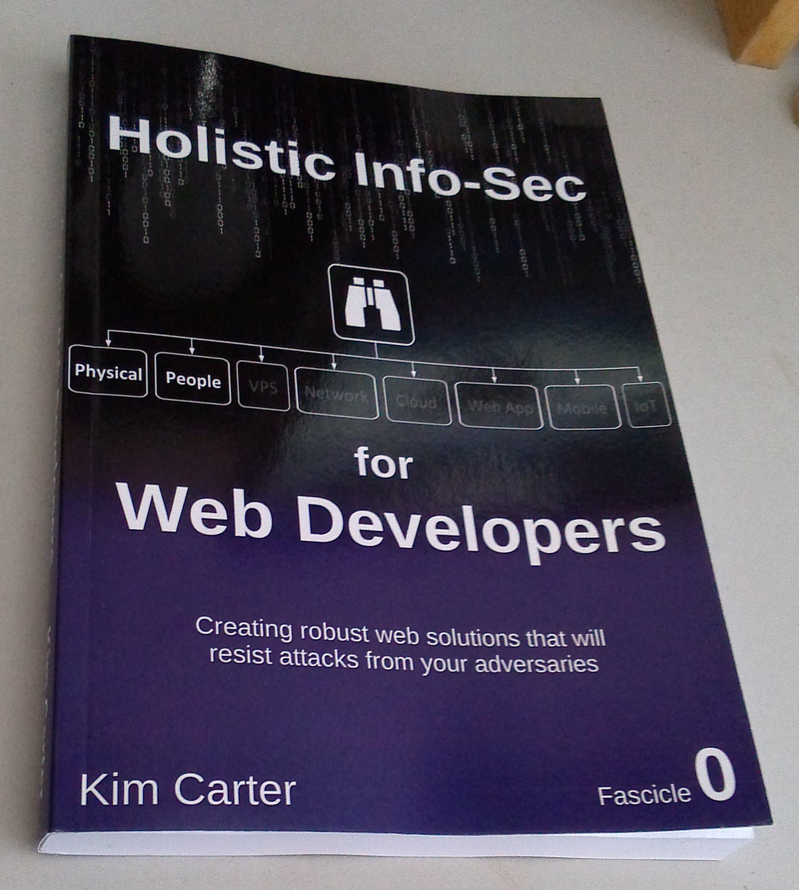

# Holistic InfoSec For Web Developers
## Fascicle 0

The contents of Fascicle 0 is now considered complete and can be found at the books [landing page](https://f0.holisticinfosecforwebdevelopers.com/). Hard copies can be purchased from [Amazon](https://www.amazon.com/Holistic-InfoSec-Web-Developers-Physical/dp/1537444190/).

The entire book series can be found [here](https://holisticinfosecforwebdevelopers.com/) at [www.holisticinfosecforwebdevelopers.com](https://holisticinfosecforwebdevelopers.com/)

 

## Table of Contents (in source)

* [Foreward](manuscript/markdown/front/foreword.md)
* [Preface](manuscript/markdown/front/preface.md)
* [Introduction](manuscript/markdown/front/introduction.md)
* [Chapter 1: The 30,000' View](manuscript/markdown/main/chapter1.md)
* [Chapter 2: The 10,000' View](manuscript/markdown/main/chapter2.md)
* [Chapter 3: Tooling Setup](manuscript/markdown/main/chapter3.md)
* [Chapter 4: Process](manuscript/markdown/main/chapter4.md)
* [Chapter 5: Physical](manuscript/markdown/main/chapter5.md)
* [Chapter 6: People](manuscript/markdown/main/chapter6.md)

