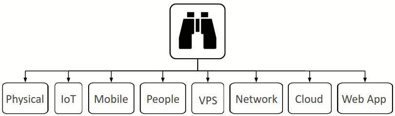

# Starting with the 30,000' view

This modelling process should be performed by a collection of the following people:
 1. Deeply technical (software expert (developer/engineer)). I specifically don't mention tester(s) here, as testing is the job of the developer. The developer is responsible for delivering high quality working code every Sprint.
 2. Network expert(s)
 3. Domain expert(s) 
 4. The person solely responsible for the project or product being delivered
 5. Person(s) with security specialisations in the areas involved in the finished product. Remember you need to step back in order for your peripheral vision to kick in.

Having this process performed by a team brings out the best in everyone. There are of course times when it's more effective to break out and work alone for a period of time.

## 1. SSM Asset Identification
* [MS 1. Identify Assets](https://msdn.microsoft.com/en-us/library/ff648644.aspx#c03618429_006)
* [OWASP Assets](https://www.owasp.org/index.php/Application_Threat_Modeling#Assets)

Assets will often emerge as you progress through the following steps.

## 2. SSM Identify Risks
* [MS 2. Create an Architecture Overview](https://msdn.microsoft.com/en-us/library/ff648644.aspx#c03618429_007)
* [MS 3. Decompose the Application](https://msdn.microsoft.com/en-us/library/ff648644.aspx#c03618429_008)
* [MS 4. Identify the Threats](https://msdn.microsoft.com/en-us/library/ff648644.aspx#c03618429_009)
* [OWASP Threat Model Information](https://www.owasp.org/index.php/Application_Threat_Modeling#Threat_Model_Information)
* [OWASP External Dependencies](https://www.owasp.org/index.php/Application_Threat_Modeling#External_Dependencies)
* [OWASP Entry Points](https://www.owasp.org/index.php/Application_Threat_Modeling#Entry_Points)

 I also like to abstract things a bit here and think about some of the entities that could be risky to the target business.

<a name="threat-agents"/>
 

 Then think about some of the relationships the target business depends on...  
How they could be leaking IP.

<a name="likelihood-and-impact"/>
 

{ms-5-document-the-threats}
* [MS 5. Document the Threats](https://msdn.microsoft.com/en-us/library/ff648644.aspx#c03618429_010)
{owasp-risk-rating-methodology}
* [OWASP Risk Rating Methodology](https://www.owasp.org/index.php/OWASP_Risk_Rating_Methodology) Used in my talk ["Does Your Cloud Solution Look Like a Mushroom"](https://speakerdeck.com/binarymist/does-your-cloud-solution-look-like-a-mushroom) on slides
 * Likelihood "Threat Agent Factors"
 * Likelihood "Vulnerability Factors"
 * Impact    "Technical Factors"
 * Impact    "Business Factors"  

{intel-threat-agent-library}
  and the [Intel Threat Agent Library](http://www.sbs.ox.ac.uk/cybersecurity-capacity/system/files/Intel%20-%20Threat%20Agent%20Library%20Helps%20Identify%20Information%20Security%20Risks.pdf)
* [OWASP Threat Analysis](https://www.owasp.org/index.php/Application_Threat_Modeling#Threat_Analysis)
{owasp-ranking-of-threats}
* [OWASP Ranking of Threats](https://www.owasp.org/index.php/Application_Threat_Modeling#Ranking_of_Threats)
{ms-6-rate-the-threats}
* [MS 6. Rate the Threats](https://msdn.microsoft.com/en-us/library/ff648644.aspx#c03618429_011)  Used in my talk ["Does Your Cloud Solution Look Like a Mushroom"](https://speakerdeck.com/binarymist/does-your-cloud-solution-look-like-a-mushroom) on slide
 * Risk = Likelihood * Impact
* Just as you would with any development features, create Product Backlog Items (PBI's) and order based on highest scoring risks.

 
 <!---This is where the images live: https://raw.githubusercontent.com/wiki/binarymist/HolisticInfoSec-For-WebDevelopers/BinaryMist-Approach-To-Threat-Modelling-Assets/BobTheBuilder.jpg-->

Keep your eye on the vulnerability advisories:  
* [National Vulnerability Database](https://web.nvd.nist.gov/view/vuln/search)
* [Exploit Database](https://www.exploit-db.com/) from Offensive Security

## 3. SSM Countermeasures
* [OWASP Countermeasure Identification](https://www.owasp.org/index.php/Application_Threat_Modeling#Countermeasure_Identification)
* [MS STRIDE provides countermeasures to identified threats](https://msdn.microsoft.com/en-us/library/ff648641.aspx#c02618429_005)
* [MS Threats and Countermeasures](https://msdn.microsoft.com/en-us/library/ff648641.aspx)

## 4. SSM Risks that Solution Causes

This is really dependent on the solution(s) you discover.

* Make sure before you test that you have written permission for all the areas that you're about to test, documenting what could possibly go wrong.
* Make sure you have backups and that they work.
* Complacency?
* Spending too much on technological solutions and ignoring the fact that the person on the front desk can easily be tricked to reveal information an attacker needs or lower the defences of a computer system. See the section on [People](#people).

## 5. SSM Costs and Trade-offs
I'm not here to do the work for you, but rather to help you do it.

> Give a man a fish and feed him for a day. Teach a man to fish and feed him for life

This is really dependent on the solution(s) you discover.

Counter-Measures costs - vs - Breach Costs

