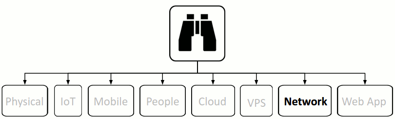

{#network}
#Network



## 1. SSM Asset Identification
Take results from [higher level Asset Identification](#1-ssm-asset-identification). Remove any that are not applicable. Add any newly discovered.

## 2. SSM Identify Risks
Go through same process as we did at the [top level](#2-ssm-identify-risks), but for the network.
* [MS Network Threats and Countermeasures](https://msdn.microsoft.com/en-us/library/ff648641.aspx#c02618429_006)

Network risks are obviously huge. I'm probably not even going to scratch the surface here at this stage. 

<a name="network-identify-risks-spoofing"/>
### Spoofing

Spoofing on a network is the act of an entity (often malicious(Mallory), [but not necessarily](http://blog.binarymist.net/2015/04/25/web-server-log-management/#mitm)) successfully masquerading/impersonating another (Bob) in order to receive information from Alice (sometimes via Eve) that should then reach Bob.

The following are some of the different types of network spoofing 

<a name="network-identify-risks-spoofing-ip"/>
#### [IP](http://en.wikipedia.org/wiki/IP_address_spoofing)


Setting the IP address in your header to the victims IP address.

This is where a sending node will spoof its public IP address (not actually change its IP address) (by forging the header) to look like someone else's. When the message is received and a reply crafted, the entity creating the reply will look up its ARP table and send the reply to the impersonated entity because the MAC address is still associated with the IP address of the message it received. This sort of play is commonly used in Denial of Service (DoS) attacks, because the attacker does not need or want the response.

In a Distributed DoS (D-DoS) Often the attacker will impersonate the target (often a router or some server it want to be brought to its knees) and broadcast messages. The nodes that receive these messages consult their ARP tables looking up the spoofed IP address and find the targets associated MAC address and reply to it. This way the replies will be sourced from many nodes. Thus swamping the targets network interface.  
Many load testing tools also use this technique to stress a server or application.

<a name="network-identify-risks-spoofing-arp"/>
#### ARP (Address Resolution Protocol)


Telling your target that the MAC address it associates with a particular legitimate node (by way of IP address) is now your (the attackers/MitM) MAC address.

Taking the IP spoofing attack further. The MitM sends out ARP replies across the LAN to the target, telling it that the legitimate MAC address that the target associates with the MitM box has now changed to say the routers IP address. This way when the target wants to send a message to say the router, it looks up its ARP table for the routers IP address in order to find its MAC address and now gets the MitM MAC address for the routers IP address, thus the targets ARP cache is said to be poisoned with the MitM MAC address. The target goes ahead and sends its messages to the MitM box which can do what ever it likes with the data. Choose to drop the message or to forward it on to the router in its original or altered state.  
This attack only works on a LAN.  
The attack is often used as a component of larger attacks, harvesting credentials, cookies, CSRF tokens, hijacking. Even using TLS (in many cases TLS can be [downgraded](network-identify-risks-tls-downgrade)). 


* [MitM with ARP spoofing](http://blog.binarymist.net/2015/04/25/web-server-log-management/#mitm)
* [With TLS](http://frishit.com/tag/ettercap/)

<a name="network-identify-risks-spoofing-dns"/>
#### DNS


Affects any domain name lookup. That includes email.
This type of attack could allow an intermediary to intercept and read all company emails for example. Completely destroying any competitive advantage. The victim may never know it's happened.  
DNS spoofing refers to an end goal rather than a specific type of attack. There are many ways to spoof a name server.

* Compromise the name server itself potentially through it's own vulnerabilities ([Kaminsky bug](http://cve.mitre.org/cgi-bin/cvename.cgi?name=CVE-2008-1447) for example)
* Poison the cache of the name server
* Poison the cache of an upstream name server and wait for the downstream propagation
* MitM attack. A good example of this is:
 * cloning a website you hope your victim will visit
 * offering a free wifi hot-spot attached to your gateway with DNS server provided.
 Your DNS server provides your cloned website IP address. You may still have to deal with X.509 certificates though, unless the website enforces TLS across the entire site, which is definitely my recommendation. If not, and the potential victim already has the websites certificate they are wanting to visit in their browser, then you'll have to hope your victim will click through the warning or work out a TLS downgrade which is going to be harder.

[dnschef](http://www.question-defense.com/2012/12/14/dnschef-backtrack-privilege-escalation-spoofing-attacks-network-spoofing-dnschef) is a flexible spoofing tool. Would be interesting to test on the likes of Arpon and Unbound.

<a name="network-identify-risks-spoofing-referrer"/>
#### Referrer


This comes under the [OWASP Top 10 A7 Missing Function Level Access Control](https://www.owasp.org/index.php/Top_10_2013-A7-Missing_Function_Level_Access_Control)

Often websites will allow access to certain resources so long as the request was referred from a specific page defined by the `referer` header.  
The referrer (spelled `referer`) field in HTTP requests can be intercepted and modified, so it's not a good idea to use it for authentication or authorisation.


<a name="network-identify-risks-spoofing-email-address"/>
#### E-Mail Address


The act of creating and sending an email with a forged sender address.
This is useful for spam campaigns sending large numbers of email and for social engineers often sending small numbers of email. The headers can be specified easily on the command line. The tools used essentially modify the headers: `From` and `Return-Path`.

Most people just assume that an email they've received came from the address it appears to be sent from. The Email headers are very easy to tamper with.
Often other types of spoofing attacks are necessary in order to have the `From` and `Return-Path` set to an address that a victim recognises and trust rather than the attackers address or some other obviously obscure address.

There are also [on-line services](http://www.anonymailer.net/) that allow the sending of email and specifying any from address.

Often the sender of a spoofed email will use a from address that you recognise in hope that you'll click on a link within the email thus satisfying their phish.

<a name="network-identify-risks-spoofing-website"/>
#### Website


<!---Todo: Check out Subterfuge, mentioned in "Basic Security Testing With Kali Linux"-->
<!---Todo: pg 160 of "The Hacker Playbook" could be worth demoing here-->
An attacker can clone a legitimate website (with the likes of the Social Engineering Kit (SET)) and through [social engineering](#people), phishing, email spoofing or any other number of tricks coerce a victim to browse the spoofed website. Once on the spoofed website, the attacker can harvest credentials or carry out many other types of attacks against the non-suspecting user.

Often a website is cloned that the victim visits regularly, which can even remove the need for social engineering, phishing, email spoofing. The victim visits the attackers cloned website due to ARP or DNS spoofing. The attacker can do any number of things at this point. Simply harvest credentials or launch many different types of attacks. For example Subterfuge to run a plethora of attacks against the victims browser through the likes of the Metasploit Browser AutoPwn module. If >0 attacks are successful, the attacker will usually get a remote command shell to the victims system. Then simply forward them onto the legitimate website without them even being aware of the attack.


<a name="network-identify-risks-wrongfully-trusting-the-loading-of-untrusted-web-resources"/>
### Wrongfully Trusting the Loading of Untrusted Web Resources


By default, the browser allows all resources from all locations to be loaded. What would happen if one of those servers was compromised or an attacker was tampering with the payload potentially changing what was expected for something malicious to be executed once loaded?


<a name="network-identify-risks-tls-downgrade"/>
### TLS Downgrade


When ever a user browses to a website, an attacker can intercept the request before the TLS handshake is made and redirect the user to the same website but without the TLS.

This is a danger for all websites that don't enforce TLS for every page. For example many websites are run over plain HTTP until the user wants to log-in. At which point the browser issues a request to an HTTPS resource (that's listed on an unencrypted page). These requests can easily be intercepted and downgraded to a plain HTTP request.

<a name="network-identify-risks-firewall-router"/>
### Firewall/Router

Routing Configurations
_Todo_

## 3. SSM Countermeasures

* [MS Network Threats and Countermeasures](https://msdn.microsoft.com/en-us/library/ff648641.aspx#c02618429_006)

<a name="network-countermeasures-spoofing"/>
### Spoofing

<a name="network-countermeasures-spoofing-ip"/>
#### IP


Filter incoming packets (ingress) that appear to come from an internal IP address at your perimeter.  
Filter outgoing packets (egress) that appear to originate from an invalid local IP address.  
Not relying on IP source address's for authentication (AKA trust relationships). I've seen this on quite a few occasions when I was younger and it didn't feel right, but I couldn't put my finger on why? Now it's obvious.

<a name="network-countermeasures-spoofing-arp"/>
#### ARP (Address Resolution Protocol)


Use spoofing detection software.  
As ARP poisoning is quite noisy. The attacker continually sends [ARP packets](http://en.wikipedia.org/wiki/Address_Resolution_Protocol), IDS can detect and flag it. Then an IPS can deal with it.

Tools such as free and open source [ArpON (ARP handler inspection)](http://arpon.sourceforge.net/) do the whole job plus a lot more.  
There's also [ArpWatch](http://linux.die.net/man/8/arpwatch) and others.

Thoughts on [mitigations](http://www.jaringankita.com/blog/defense-arp-spoofing)

<a name="network-countermeasures-spoofing-dns"/>
#### DNS


Many cache poisoning attacks can be prevented on DNS servers by being less trusting of the information passed to them by other DNS servers, and ignoring any DNS records passed back which are not directly relevant to the query.

[DNS Security Extensions](http://www.dnssec.net/) does the following for us. You'll probably need to configure it though on your name server(s). I did.
* DNS cache poisoning
* Origin authentication of DNS data
* Data integrity
* Authenticated denial of existence

Make sure your [Name Server](http://www.dnssec.net/software) supports DNSSEC.

<a name="network-countermeasures-spoofing-referrer"/>
#### Referrer


Deny all access by default. Require explicit grants to specific roles for access to every function. Implement checks in the controller and possibly the business logic also (defence in depth). Never trust the fact that certain resources appear to be hidden so a user wont be able to access them. 

Check the [OWASP Failure to Restrict URL Access](https://www.owasp.org/index.php/Top_10_2007-Failure_to_Restrict_URL_Access) for countermeasures and the [Guide to Authorisation](https://www.owasp.org/index.php/Guide_to_Authorization).

<a name="network-countermeasures-spoofing-email-address"/>
#### EMail Address


Spoofing of Email is hard to trace and stop.

Key-pair encryption helps somewhat. The headers can still be spoofed, but the message can not, thus providing secrecy and authenticity:

* GPG/PGP (uses "web of trust" for key-pairs)  
Application Layer  
Used to encrypt an email message body, any file for that matter and also signing.  
Email headers not encrypted

* S/MIME (uses Certificate Authorities (CA's)(Can be in-house) TLS using PKI)  
Application Layer  
Used to encrypt an email message body and also signing  
Email headers not encrypted

The way the industry is going currently it's looking like the above (same) key-pair encryption will probably be replaced with Forward Secrecy who's key changes on each exchange.

GPG/PGP and S/MIME are similar concepts. Both allow the consumer to encrypt things inside an email.  
See my detailed post on GPG/PGP [here](http://blog.binarymist.net/2015/01/31/gnupg-key-pair-with-sub-keys/) for more details.

I've noticed some confusion surrounding S/MIME vs TLS.
TLS works at the transport & session layer as opposed to S/MIME at the Application Layer. The only similarity I see is that they both use CA's.

* Adjust your spam filters
* Read your message headers and trace IP addresses, although any decent self respecting spammer or social engineer is going to be using proxies.
* Don't click links or execute files from unsolicited emails even if the email appears to be from someone you know. It may not be.
* Make sure your mail provider is using [Domain-based Message Authentication, Reporting and Conformance (DMARC)](http://dmarc.org/)
 * Sender Policy Framework (SPF)
 * DomainKeys Identified Mail (DKIM)

<a name="network-countermeasures-spoofing-website"/>
#### Website


There's nothing to stop someone cloning and hosting a website. The vital part to getting someone to visit an attackers illegitimate website is to either social engineer them to visit it, or just clone a website that you know they are likely to visit. An Intranet at your work place for example. Then you will need to carry out ARP and/or DNS spoofing. Again
tools such as free and open source [ArpON (ARP handler inspection)](http://arpon.sourceforge.net/) cover website spoofing and a lot more.

<a name="network-countermeasures-wrongfully-trusting-the-loading-of-untrusted-web-resources"/>
### Wrongfully Trusting the Loading of Untrusted Web Resources

* Escaping all untrusted data based on it's context (where and what it is)
* White-list
* Constrain to types where possibly
* Constrain max / min lengths.
* Basically think in terms of least privilege

<a href="https://www.owasp.org/index.php/Top_10_2013-A3-Cross-Site_Scripting_(XSS)">OWASP Top 10 A3 Cross Site Scripting (XSS)</a>

<a name="network-countermeasures-wrongfully-trusting-the-loading-of-untrusted-web-resources-csp"/>
#### Content Security Policy (CSP)


By using CSP, we're providing the browser with a white-list of the types of resources and from where, that we allow to be loaded.  
We do this by specifying particular response headers (more specifically directives).


Names removed to save embarrassment. Sadly most banks don't take their web security very seriously.

```bash
curl --head https://reputable.kiwi.bank.co.nz/

Content-Security-Policy: default-src 'self' secure.reputable.kiwi.bank.co.nz;
connect-src 'self' secure.reputable.kiwi.bank.co.nz;
frame-src 'self' secure.reputable.kiwi.bank.co.nz player.vimeo.com;
img-src 'self' secure.reputable.kiwi.bank.co.nz *.g.doubleclick.net www.google.com www.google.co.nz www.google-analytics.com seal.entrust.net;
object-src 'self' secure.reputable.kiwi.bank.co.nz seal.entrust.net;
# In either case, authors SHOULD NOT include either 'unsafe-inline' or data: as valid sources in their policies. Both enable XSS attacks by allowing code to be included directly in the document itself
# unsafe-eval should go without saying
script-src 'self' 'unsafe-eval' 'unsafe-inline' secure.reputable.kiwi.bank.co.nz seal.entrust.net www.googletagmanager.com www.googleadservices.com www.google-analytics.com;
style-src 'self' 'unsafe-inline' secure.reputable.kiwi.bank.co.nz seal.entrust.net;
```


Of course this is only as good as a clients connection is trusted. If the connection is not over TLS, then there is no real safety that the headers can't be changed. If the connection is over TLS, but the connection is intercepted before the TLS hand-shake, the same lack of trust applies. See the section on [TLS Downgrade](#network-countermeasures-tls-downgrade) for more information.  
Not to be confused with Cross Origin Resource Sharing (CORS). CORS instructs the browser to over-ride the "same origin policy" thus allowing AJAX requests to be made to header specified alternative domains. For example: web site a allows restricted resources on its web page to be requested from another domain outside the domain from which the resource originated. Thus specifically knowing and allowing specific other domains access to its resources.


* [Slide Deck](http://www.slideshare.net/fmarier/owaspnzday2012) from Francois Marier
* [Another Slide Deck](https://speakerdeck.com/fmarier/integrity-protection-for-third-party-javascript) from Francois Marier. Also covering HTTP Strict Transport Security (HSTS)
* Easy Reading: [OWASP](https://www.owasp.org/index.php/Content_Security_Policy)
* [OWASP CSP Cheat Sheet](https://www.owasp.org/index.php/Content_Security_Policy_Cheat_Sheet) which also lists which directives are new in version 2
* MDN easily digestible [help](https://developer.mozilla.org/en-US/docs/Web/Security/CSP) on using CSP
* Easy, but more in-depth:
 * [W3C specification 2](http://www.w3.org/TR/CSP2). It is the specification after all. Not sure about browser support here yet.  
 _Todo: write script that performs feature detection of version 2 of the specification._
 * [W3C specification 1.1](http://www.w3.org/TR/2014/WD-CSP11-20140211/). Most browsers currently [support](http://caniuse.com/contentsecuritypolicy) this version. IE 11 has partial support.

<a name="network-countermeasures-wrongfully-trusting-the-loading-of-untrusted-web-resources-sri"/>
#### Sub-resource Integrity (SRI)


Provides the browser with the ability to verify that fetched resources (the actual content) haven't been tampered with, potentially swapping the expected resource or modifying it for a malicious resource, no matter where it comes from.

How it plays out:  
Requested resources also have an attribute `integrity` with the cryptographic hash of the expected resource. The browser checks the actual hash against the expected hash. If they don't match the requested resource will be blocked.

```html
<script src="https://example.com/example-framework.js"
    integrity="sha256-C6CB9UYIS9UJeqinPHWTHVqh/E1uhG5Twh+Y5qFQmYg="
    crossorigin="anonymous"></script>
```

This is of course only useful for content that changes rarely or is under your control. Scripts that are dynamically generated and out of your control are not really a good fit for SRI. If they're dynamically generated as part of your build, then you can also embed the hash into the requesting resource as part of your build process. 
Currently `script` and `link` tags are supported. Future versions of the specification are likely to expand this coverage to other tags.

SRI is also useful for applying the hash of the likes of minified, concatenated and compressed resources to the name of them for invalidating browser cache.

SRI can be used right now. Only the latest browsers are currently supporting SRI, but the extra attributes are simply ignored by browsers that don't currently provide support.

Tools such as openssl and the standard sha[256|512]sum programmes normally supplied with your operating system will do the job. The hash value provided needs to be base64 encoded.

* [Slide Deck](https://speakerdeck.com/fmarier/integrity-protection-for-third-party-javascript) from Francois Marier. Covering other headers also
* [W3C specification](http://www.w3.org/TR/SRI/)

<a name="network-countermeasures-tls-downgrade"/>
### TLS Downgrade

<a name="network-countermeasures-tls-downgrade-hsts"/>
#### HTTP Strict Transport Security (HSTS)


Trust the browser to do something to stop these **downgrades**.

```bash
curl --head https://reputable.kiwi.bank.co.nz/

Strict-Transport-Security: max-age=31536000
```

By using the HSTS header, you're telling the browser that your website should never be reached over plain HTTP.  
There is however still a problem with this. The very first request for the websites page. At this point the browser has no idea about HSTS because it still hasn't fetched that first page that will come with the header. Once the browser does receive the header, if it does, it records this information against the domain.  
Welcome to [HSTS Preload](#user-content-network-countermeasures-tls-downgrade-hsts-preload)

* [Another Slide Deck](https://speakerdeck.com/fmarier/integrity-protection-for-third-party-javascript) from Francois Marier. Also covering HTTP Strict Transport Security (HSTS)
* MDN easily digestible [help](https://developer.mozilla.org/en-US/docs/Web/Security/CSP) on using HSTS
* Easy Reading: [OWASP](https://www.owasp.org/index.php/HTTP_Strict_Transport_Security)
* [IETF specification](https://tools.ietf.org/html/draft-ietf-websec-strict-transport-sec-14). Most browsers currently have support. IE < 12 doesn't. 12 is [expected to](http://blogs.msdn.com/b/ie/archive/2015/02/16/http-strict-transport-security-comes-to-internet-explorer.aspx).

[Online Certificate Status Protocol (OCSP)](CertificateRevocation#initiative-2-online-certificate-status-protocol-ocsp) is very similar to HSTS, but at the X.509 certificate level.

<a name="network-countermeasures-tls-downgrade-hsts-preload"/>
#### HTTP Strict Transport Security (HSTS) Preload


This includes a list that browsers have with any domains that have been submitted. When a use requests one of the pages from a domain on the browsers HSTS preload list, the browser will always initiate all requests to that domain over TLS.

In order to have your domain added to the browsers preload list, submit it [here](https://hstspreload.appspot.com/).

[OCSP Must-Staple](CertificateRevocation#initiative-4-fix-to-the-ocsp-stapling-problem) is very similar to HSTS Preload, but at the X.509 certificate level.

<a name="network-countermeasures-firewall-router"/>
### Firewall/Router
I don't trust commercial proprietary routers. I've seen too many vulnerabilities in them to take them seriously for any network I have control of. Yes open source hardware and software routers can and do have vulnerabilities, but they can be patched. There are a few good choices here. Some of which also come with enterprise support if you want it. This means the software and the hardware, if you choose to obtain the hardware as well is open to inspection. The vendor also supplies regular firmware updates which is crucial for there to be any hope of having a system that in some way resembles a device that places a priority on your networks security.

Most closed routers suffer from the [same problems](https://securityevaluators.com/knowledge/case_studies/routers/soho_service_hacks.php) I illustrate on my blog. They have active unsecured services that have little to nothing to do with routing and in many cases, you can not [Disable](http://blog.binarymist.net/2014/12/27/installation-hardening-of-debian-web-server/#disable-services-we-dont-need), [Remove](http://blog.binarymist.net/2014/12/27/installation-hardening-of-debian-web-server/#remove-services), or [Harden](http://blog.binarymist.net/2014/12/27/installation-hardening-of-debian-web-server/#secure-services) them.

### Network Intrusion Detection Systems (NIDS)
Similar to [HIDS](#host-intrusion-detection-systems-hids) but acting as a network spy with its network interface (NIC) in promiscuous mode, capturing all traffic crossing the specific network segment that the NIDS is on.

As HIDS, NIDS also operate with signatures.

1. String signatures look like known attack strings or sub-strings. "_For example, such a string signature in UNIX can be "cat "+ +" > /.rhosts" , which if executed, can cause the system to become extremely vulnerable to network attack._" 
2. Port: "_Port signatures commonly probes for the connection setup attempts to well known, and frequently attacked ports. Obvious examples include telnet (TCP port 23), FTP (TCP port 21/20), SUNRPC (TCP/UDP port 111), and IMAP (TCP port 143). If these ports aren't being used by the site at a point in time, then the incoming packets directed to these ports are considered suspicious._"
3. Header condition: "_Header signatures are designed to watch for dangerous or illegitimate combinations in packet headers fields. The most famous example is Winnuke, in which a packet's port field is NetBIOS port and one of the Urgent pointer, or Out Of Band pointer is set. In earlier version of Windows, this resulted in the "blue screen of death". Another well known such header signature is a TCP packet header in which both the SYN and FIN flags are set. This signifies that the requestor is attempting to start and stop a connection simultaneously._"

Quotes from the excellent [Survey of Current Network Intrusion Detection Techniques](http://www1.cse.wustl.edu/~jain/cse571-07/ftp/ids/index.html)

Some NIDS go further to not only detect but prevent. They are known as Network Intrusion Prevention Systems NIPS.

It's a good idea to have both Host and Network IDS/IPS in place at a minimum. I personally like to have more than one tool doing the same job but with different areas of strength covering the weaker areas of its sibling. An example of this is with HIDS. Having one HIDS on the system it's protecting and another somewhere else on the network, or even on another network completely, looking into the host and performing its checks. This makes discoverability difficult for an attacker.

### Vulnerability Scanners

For infrastructure scanning use OpenVAS which is a free fork from Nessus after the tool went proprietary in 2005. I wrote about it [here](http://blog.binarymist.net/2014/03/29/up-and-running-with-kali-linux-and-friends/#vulnerability-scanners).

_Todo_ document others.

## 4. SSM Risks that Solution Causes
> Are there any? If so what are they?

<a name="network-risks-that-solution-causes-wrongfully-trusting-the-loading-of-untrusted-web-resources"/>
### Wrongfully Trusting the Loading of Untrusted Web Resources

<a name="network-risks-that-solution-causes-wrongfully-trusting-the-loading-of-untrusted-web-resources-csp"/>
#### Content Security Policy (CSP)

Trusting the (all supported) browser(s) to do the right thing.  
Don't. Remember defence in depth. Expect each layer to fail, but do your best to make sure it doesn't. Check the likes of the OWASP <a href="https://www.owasp.org/index.php/Top_10_2013-A3-Cross-Site_Scripting_(XSS)">How Do I Prevent Cross-Site Scripting (XSS)</a> for taking the responsibility yourself rather than deferring to trust the clients browser.

Take care in making sure all requests are to HTTPS URLs. You could also automate this as part of your linting procedure or on a pre-commit hook on source control.

Make sure your web server only ever responds over HTTPS, including the very first response.

<a name="network-risks-that-solution-causes-wrongfully-trusting-the-loading-of-untrusted-web-resources-sri"/>
#### Sub-resource Integrity (SRI)

Similar to the above with trusting the browser to support the SRI header. All requests should be made over HTTPS. The server should not respond to any requests for unencrypted data.

Take care in making sure all requests are to HTTPS URLs. You could also automate this as part of your linting procedure on a pre-commit hook or source control.

Make sure your web server only ever responds over HTTPS, including the very first response.

<a name="network-risks-that-solution-causes-tls-downgrade"/>
### TLS Downgrade

<a name="network-risks-that-solution-causes-tls-downgrade-hsts"/>
#### HTTP Strict Transport Security (HSTS)

Unless the browsers know about your domain and have it added to their HSTS Preload list, then the connection is still not safe.

Make sure your web server only ever responds over HTTPS, including the very first response.

<a name="network-risks-that-solution-causes-tls-downgrade-hsts-preload"/>
#### HTTP Strict Transport Security (HSTS) Preload

Again your trusting the browser.

## 5. SSM Costs and Trade-offs
> An exercise for the reader. What are they?

# Wireless
A really large can of worms

_Todo_
