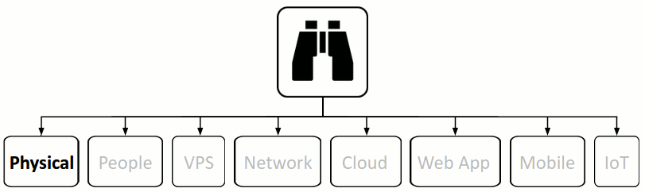

{#physical}
# Physical

The area of physical security is often over looked, especially by technical people, although in most cases, it's the easiest and simplest to circumvent and also the easiest and simplest to mitigate.

## 1. SSM Asset Identification
Take results from [higher level Asset Identification](#1-ssm-asset-identification). Remove any that are not applicable. Add any newly discovered.

## 2. SSM Identify Risks
You can take the same process that we did at the [top level](#2-ssm-identify-risks), but abstract the ideas and then solidify them on physical components. Some of the ideas will work, some wont.

Many times physical security is good, but it's compromised by the people problem. My wife used to do a lot of commercial cleaning and every night she would come home with new stories about how people were the weakest link when it came to security. Most of the time when physical security is breached there actually is no security, because **people** have failed the design.

I'm also a qualified carpenter and as part of my job when I was practising was often required to break into buildings when tenants had done the runner, so I know a few things about physical security as well. Even when doors and windows are locked, their security is fairly simple to compromise without damaging anything. Funnily enough, it was seldom required to force latches, bump or pick locks. There is always a path of least resistance, the lowest hanging fruit, because people are always the weakest link in any security solution.

{#physical-identify-risks-fortress-mentality}
### Fortress Mentality

We see the same analogy of the candy bar (fortress) running through many areas of security.  
“_Many organizations still adopt a fortress mentality, where everyone on the outside is bad and stuff on the inside is less dangerous_,” said Brian Krebs, author of the Krebs on Security blog. “_Years of experience has taught us that the biggest problems often stem from the fact that once something gets through the outer defenses, it’s often a cakewalk to move around the internal network unimpeded._”  
We not only see this principle applied to networks, but also physical security.

<a name="physical-identify-risks-internal-doors-and-cabinets-unlocked"/>
### Internal Doors and Cabinets Left Unlocked

Filing cabinets and other cupboards left unlocked or locked and keys or combinations put in obvious places.

<a name="physical-identify-risks-insecure-doors-windows"/>
### Insecure Doors and/or Windows

Open doors, open windows. Uninteresting right, because there seems to be little challenge to mitigate. So little challenge that the vulnerability often gets ignored. Believe it or not, but it's often the cleaners responsibility to lock doors, windows and set alarms. I've discussed some of these types of threat agents [here](http://blog.binarymist.net/2012/11/04/sanitising-user-input-from-browser-part-1/#threat-agents). Many places I've worked in have had double latched windows only single latched when I do the rounds just before I leave. It's very easy to pry a double latch window open from the outside that is single latched.

<a name="physical-identify-risks-computers-logged-in-unlocked"/>
### Computers Logged in and Unlocked

Computers logged in, not locked and even screens still turned on. Often with very sensitive material clearly displayed on the screens. This is very common. Again physical security is rendered useless due to the people problem.

<a name="physical-identify-risks-rfid"/>
### RFID Tags

Then there's all the RFID cards, tags for accessing buildings, elevators, car parks, etc. Again, relatively easily exploitable with [readers and cloners](http://proxmark3.com/products/PM3KIT/) which you can buy for varying prices or build your own.

 

Of course there are many more, but I'm running out of time, so I'm going to move on for now and hopefully come back to this.

## 3. SSM Countermeasures
<a name="physical-countermeasures-fortress-mentality"/>

### Fortress Mentality

Harden internal attack vectors. BinaryMist takes the approach of [De-perimeterisation](http://blog.binarymist.net/2014/12/27/installation-hardening-of-debian-web-server/#fire-walling). That's   not relying on network firewalls or LAN segmentation. [Hardening every layer](http://blog.binarymist.net/2014/12/27/installation-hardening-of-debian-web-server/#fire-walling) (defence in depth) as though all other layers are weak and easily compromised. I've [blogged](http://blog.binarymist.net/2012/11/04/sanitising-user-input-from-browser-part-1/#defense-in-depth) and [spoken](http://blog.binarymist.net/presentations-publications/#whats-our-software-doing-with-all-that-user-input) about this on many occasions.

<a name="physical-countermeasures-internal-doors-and-cabinets-unlocked"/>
### Internal Doors and Cabinets Left Unlocked

1. Education
2. Test that the education is taking effect.

<a name="physical-countermeasures-insecure-doors-windows"/>
### Insecure Doors and/or Windows

Similar to [Computers Logged in and Unlocked](#computers-logged-in-and-unlocked)

<a name="physical-countermeasures-computers-logged-in-unlocked"/>
### Computers Logged in and Unlocked

Most of what you can do here comes down to the people problem:

1. Educating your workers
3. Creating a [culture](http://blog.binarymist.net/2014/04/26/culture-in-the-work-place/) that thinks about security and includes it as part of who they are
4. Test your workers. Measure the results. Make sure your investment is falling on fertile ground and actually taking root. Adjust your training and change techniques to address weak areas. Measure again. Keep iterating on this.
3. Again simple stuff, but from my experience, if your organisation falls into this bucket, until an attacker takes advantage of this, management seems blissfully unaware. So... If you see it, put your [change agent skills](http://blog.binarymist.net/2014/04/26/culture-in-the-work-place/#effecting-change) to work. This can take significant cultural change. Be patient and make that change move from ground up. It doesn't matter where you sit in the organisations hierarchy. If you don't really know where to start, I'd recommend grabbing a copy of [Fearless Change](http://blog.binarymist.net/2013/06/22/ideas-for-more-effective-meetings-and-presentations/). It's not about meetings and presentations by the way. I've gained a lot of insight on how to gently change organisations and bring big improvements in many areas. I'd also recommend [Nonviolent Communication](http://en.wikipedia.org/wiki/Nonviolent_Communication) by Marshall Rosenberg.

<a name="physical-countermeasures-rfid"/>
### RFID Tags

There are at least a couple of strategies to deal with RFID tag cloning

1. Preventative.
    1. Multi-factor authentication. Fingerprint, PIN number or some other type of mechanism to verify that the person swiping the card/tag is actually the owner of it.
    2. There are all sorts of methods that the chip manufacturers and security community are using to make the cloning more costly in terms of time and effort.
2. Detecting, reacting when it does happen. Methods such as:
    1. writing a new random number on the tag's memory every time it's scanned. When a tag is scanned with the same id as another tag that's been issued a new random number which is also recorded by the back-end, the back-end knows there is a duplicate tag.
    2. Video surveillance of the area where front-end (tag) to back-end (reader) communications are made

Keep in mind though, as Bruce Schneier said: "_Detection works where prevention fails and detection is of no use without response_."  
As part of Identify Risks, you'll need to apply the ranking techniques discussed in order to decide the Likelihood, Impact on what's important to your business and all the other factors that the threat modelling techniques walk you through.  
You can then use your ranking as input to the Countermeasures step. Thus helping you decide which, if any countermeasures are worth implementing.

## 4. SSM Risks that Solution Causes
> Are there any? If so what are they?

## 5. SSM Costs and Trade-offs
> An exercise for the reader. What are they?
