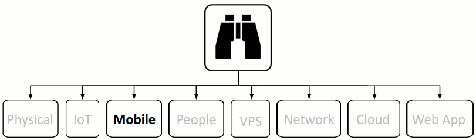

{#mobile}
# Mobile

Verint (a USA company) sells a cell phone tracking system called [SkyLock](http://apps.washingtonpost.com/g/page/business/skylock-product-description-2013/1276/) with a subtitle of "Locate. Track. Manipulate" to both corporations and governments worldwide. SkyLock not only finds people but also tracks them over time periods.

*The UK company Cobham sells a system that allows someone to send a "blind" call to a phone*. A blind call doesn't ring and is not detectable by casual visual inspection of the phone. "The blind call forces the phone to transmit on a certain frequency, allowing the sender to track that phone to within one meter"

Then there's [Infiltrator](http://infiltrator.mobi/defentek_infiltrator_real-time_global_tracking_technologies.html) from Defentek, a real-time global tracking system that *enables the end-user to monitor the targeted individual(s) activities and collect geo-location data to profile the subject(s) pattern of life and habits. This allows one too to derive to a plan of action or a motion for a warrant for further surveillance, investigation, apprehension, or decommissioning.* Infiltrator claims to be able to *locate and track any phone number in the world.* with abilities such as being able to infiltrate and be undetected by the network, carrier or the target.

Many of the applications installed on our phones are collecting your personal information such as location, sex and your phones unique identification number (UID). Applications such as Angry Birds and even the flash-light app. Even apps that deliver bible quotes.

Tobias Engel discussed in his [presentation](http://events.ccc.de/congress/2008/Fahrplan/events/2997.en.html) at the 25th Chaos Communication Congress how to locate mobile phones using SS7. His slide deck is [here](http://berlin.ccc.de/~tobias/25c3-locating-mobile-phones.pdf). Recording of the presentation [here](https://www.youtube.com/watch?v=lQ0I5tl0YLY). There are various open implementations that use the same technique such as Nicholas Skinner's [PHP application](http://www.ns-tech.co.uk/products/track-any-mobile/).

There are many offerings available to allow people to spy on other individuals activities and location in regards to mobile phones. Even though the CEO and maker of StealthGenie which was a mobile app used for spying, was [indicted and arrested](http://www.washingtonpost.com/business/technology/make-of-app-used-for-spying-indicted-in-virginia/2014/09/29/816b45b8-4805-11e4-a046-120a8a855cca_story.html) for selling it in the USA, there are many other options for doing the same like [HelloSpy](http://hellospy.com/homepage.aspx?lang=en-US), [Highster](http://www.highstermobi.com/), [MySpy](http://www.mspy.com/), [FlexiSPY](http://www.flexispy.com/)

The USA National Security Agency (NSA) and its UK counterpart, Government Communications Headquarters (GCHQ), use location data to track people.

Some resources to start with:  
https://bluebox.com/business/bluebox-and-nist-addressing-mobile-threats/  
https://media.blackhat.com/bh-us-12/Briefings/C_Miller/BH_US_12_Miller_NFC_attack_surface_WP.pdf
